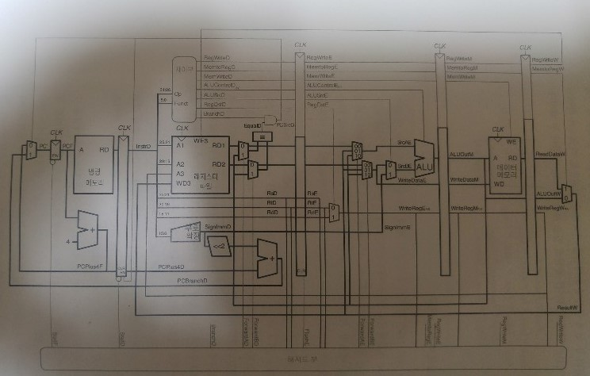

  
# 목차 
[1. alu.v](#alu)  
[2. control.v](#control)  
[3. dm.v](#dm)  
[4. ff.v](#ff)  
[5. hazard.v](#hazard)  
[6. im.v](#im)  
[7. mips.v](#mips)  
[8. mux2.v](#mux2)  
[9. mux3.v](#mux3)  
[10. p1.v](#p1)  
[11. p2.v](#p2)  
[12. p3.v](#p3)  
[13. p4.v](#p4) 
[14. pcplus4.v](#pcplus4)  
[15. rf.v](#rf)  
[16. signex.v](#signex)  
[17. sl2.v](#sl2)  
[18. testbench.v](#testbench)


# alu
> * branch명령어와 jump명령어는 ALUopcode를 0000으로 setting
```verilog
	module alu(
		input [3:0] ALUOp,
		input [31:0] a, b,
		output reg [31:0] out);
```
> 1. input으로 4bit ALUopcode,  operand A,B를 decode stage로 받는다.
```verilog
	wire [31:0] sub_ab;
	wire [31:0] add_ab;
	wire [31:0] mult_ab;
	assign sub_ab = a - b;
	assign add_ab = a + b;
	assign mult_ab = a * b;
```
>2. operand A,B의 계산값 sub, add, mult, slt를 조합회로로 구성한다.
```verilog
	wire oflow_add, oflow_sub, oflow, slt;
	assign oflow_add = (a[31] == b[31] && 	add_ab[31] != a[31]) ? 1 : 0;
	assign oflow_sub = (a[31] == b[31] && 	sub_ab[31] != a[31]) ? 1 : 0;
	assign oflow = (ALUOp == 4'b0010) ? oflow_add : oflow_sub;
	assign slt = oflow_sub ? ~(a[31]) : a[31];
```
> 3.  연산 간 overflow를 체크 하는 회로를 구성한다.  A가 양수인 경우 overflow가 나면 A<B이다. A가 음수인 경우 overflow가 안나면 A<B이다.  A가 양수의 경우 sub_overflow시 slt를 1로 set, 음수일 경우 slt를 0으로 set하면 된다.  즉 msb를 이용하면 한줄로 코드를 구성할 수 있다.
```verilog
	always @(*) 
	begin
		case (ALUOp)
			4'b0010  : out = add_ab;		/* add */
			4'b0000  : out = a & b;			/* and */
			4'b1000  : out = mult_ab;		/* mult */
			4'b1100  : out = ~(a | b);		/* nor */
			4'b0001  : out = a | b;			/* or */
			4'b0111  : out = {31'd0, slt};		/* slt */
			4'b0110  : out = sub_ab;		/* sub */
			4'b1101  : out = a ^ b;			/* xor */
			default  : out = 0;
		endcase
	end
	endmodule
```
> 4.  opcode에 따라 reg output에 값을 할당한다.  

# control
```verilog
	module control(input[5:0] Op,Funct, output reg RegWriteD, MemtoRegD,MemWriteD,output reg[3:0] ALUControlD, output reg ALUSrcD, RegDstD, BranchD,JToPCD);
```
> 1. input으로 6bit opcode를 받아 각 control bit들을 set한다.
```verilog
	always @(*)
	begin
		case (Op)
			6'b000000 : begin // R Type - add, sub, and, or, slt
				RegDstD = 1; RegWriteD = 1; ALUSrcD = 0; MemWriteD = 0; MemtoRegD = 0; JToPCD = 0; BranchD = 0;
				if(Funct == 6'b100000)	ALUControlD = 4'b0010; // add
				else if(Funct == 6'b100010) ALUControlD = 4'b0110; // sub
				else if(Funct == 6'b100100) ALUControlD = 4'b0000; // and
				else if(Funct == 6'b100101) ALUControlD = 4'b0001; // or
				else if(Funct == 6'b101010) ALUControlD = 4'b0111; // slt
				else if(Funct == 6'b011000) ALUControlD = 4'b1000; // mult
				else if(Funct == 6'b100110) ALUControlD = 4'b1101; // xor 
				else if(Funct == 6'b100111) ALUControlD = 4'b1100; // nor
				else ALUControlD = 4'b0000; // To avoid creating a latch
			end
			6'b100011 : begin // Load Word
				RegDstD = 0; RegWriteD = 1; ALUSrcD = 1; MemWriteD = 0; MemtoRegD = 1; JToPCD = 0; BranchD = 0;
				ALUControlD = 4'b0010; // add for lw
			end
			6'b101011 : begin // Store Word
				            RegWriteD = 0; ALUSrcD = 1; MemWriteD = 1; JToPCD = 0; BranchD = 0;
				ALUControlD = 4'b0010; // add for sw
				RegDstD = 0; MemtoRegD = 0; // To avoid creating a latch
			end
			6'b000100 : begin // Beq
					    RegWriteD = 0; ALUSrcD = 0; MemWriteD = 0; JToPCD = 0; BranchD = 1;
				ALUControlD = 4'b0110; // sub for beq
				RegDstD = 0; MemtoRegD = 0; // To avoid creating a latch
			end
			6'b000010 : begin// Jump
					    RegWriteD = 0; MemWriteD = 0; JToPCD = 1; BranchD= 0;
				RegDstD = 0; ALUSrcD = 0; MemtoRegD = 0; ALUControlD = 4'b0000; // To avoid creating a latch
			end
			default : begin // To avoid creating a latch
				RegDstD = 0; RegWriteD = 0; ALUSrcD = 0; MemWriteD = 0; MemtoRegD = 0; JToPCD = 0; BranchD = 0;
				ALUControlD = 4'b0000; 
			end
		endcase
	end
```
> 2. control bit('choose' means the control bit of mux)
>* RegWriteD(reg file write enable)
>* RegDstD(choose reg file wirte address)
>* MemtoRegD(choose wirte data to reg)
>* MemWriteD(data memory write enable)
>* ALUControlD(choose alu operator)
>* ALUSrcD(choose ALU operand B, rs or imm)
>* BranchD(set if branch inst)
>* JToPCD(set if jump inst)


# dm
> 1. Data memory
> 2. input
 >* WE : MemWrite
 >* WD : write data(It is from rt)
 >* A : read or wirte memory address

# ff
> 1. just flipflop(it is used for pushing next pc)
# hazard
> 1. set Forward, lwStall, branchStall bit when hazard occured
# im
>instruction memory
# mips
> mips architecture
# mux2
> mux which has 2 sources
# mux3
> mux which has 3 sources
# p1
> first pipeline
> basic paramter : instruction, pcplus4
> hazard paramter : stall, pcsrc
# p2
> second pipeline
> basic paramter : all control bit, RD data, Rs,Rt,Rd data for checking data dependency
> hazard paramter : flush
# p3
> 
# p4
# pcplus4
# rf
# signex
# sl2
# testbench
<!--stackedit_data:
eyJoaXN0b3J5IjpbMzQ1ODAwMCw1MjcyNzc3NzcsMTE3NTQxMD
A2MCwzNDAxNzIwNjAsMTc0MDAxNzY4NywxMjM2MTgwNTcwLDEx
NzYxMDc5MDAsMzU4NzQ4MTMyLC0yMjI3NjkxMTYsLTI4MjUxOD
EwMSwtNjE1NDIxOTc0LC0yMDIwMDc5MzM0LDE2NTUxNDU3NDYs
LTE0NzMyOTg4MjIsMTUwNTU0ODIyOCwxNDM1NTI5MTI2LC0xMD
c2MTU4ODgxLC0yMDQxNTkwMzA1LC0yMTc5MTQ0MjYsMjYyNjk0
MzQ2XX0=
-->